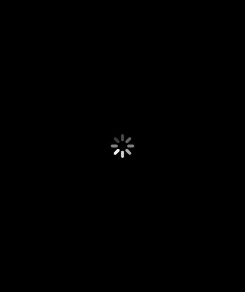
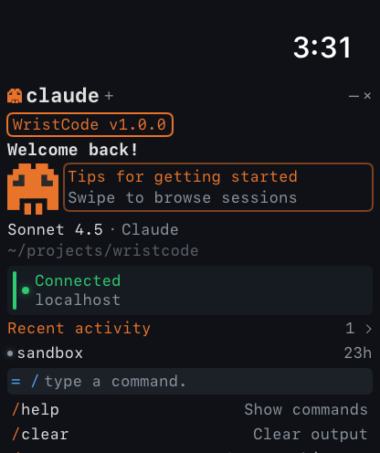

<p align="center">
  
  
  
  
</p>

<h1 align="center">WristCode</h1>

<p align="center">
  <strong>Claude Code on your Apple Watch.</strong><br/>
  Send prompts, build apps, review diffs, and preview websites — all from your wrist.
</p>

<p align="center">
  
  
  
  
  
</p>

---

## What is WristCode?

WristCode lets you control **Claude Code** sessions directly from your **Apple Watch**. It consists of:

1. **Bridge Server** — A Node.js middleware that connects your watch to Claude Code running on your Mac
2. **watchOS App** — A terminal-styled SwiftUI app with the Claude Code aesthetic

### Real Claude Code. Real execution. From your wrist.

Every prompt you send from the watch runs through the actual `claude` CLI on your Mac. Files get created, code gets written, websites get built — just like sitting at your terminal.

---

## Features

| Feature | Description |
|---------|-------------|
| **Terminal View** | Full terminal output with streaming responses, tool usage indicators, and cost tracking |
| **Voice Input** | Dictate prompts using watchOS speech recognition |
| **Session Management** | Create, browse, and switch between multiple Claude Code sessions |
| **Model Selection** | Choose between Sonnet 4.5, Opus 4.6, or Haiku 4.5 per session |
| **Diff Review** | Review code changes with colored diffs, approve or reject from your wrist |
| **Website Preview** | Build websites and preview them on your iPhone via tunnel URL |
| **Slash Commands** | `/status`, `/cost`, `/clear`, `/compact`, `/help` — all from the watch |
| **Quick Actions** | One-tap pills: "Status?", "Continue", "Fix it", "Preview", "Commit" |
| **Remote Access** | Cloudflare tunnel support — control Claude from anywhere on mobile |
| **Auto-Connect** | Bonjour mDNS discovery on local WiFi, automatic tunnel fallback |

---

## Screenshots

<p align="center">
<table>
<tr>
<td align="center"><br/><sub>Welcome</sub></td>
<td align="center"><br/><sub>Sessions</sub></td>
<td align="center"><br/><sub>Terminal</sub></td>
</tr>
<tr>
<td align="center"><br/><sub>Diff Review</sub></td>
<td align="center"><br/><sub>Settings</sub></td>
<td align="center"><br/><sub>Pairing</sub></td>
</tr>
</table>
</p>

---

## Architecture

```
┌──────────────────┐        ┌─────────────────────┐        ┌──────────────┐
│   Apple Watch    │  HTTP  │   Bridge Server      │  CLI   │  Claude Code │
│   (WristCode)    │◄──────►│   (Node.js :3847)    │◄──────►│  (claude -p) │
│                  │  WiFi/ │                      │        │              │
│  SwiftUI App     │ Tunnel │  Express + SSE +     │        │  Real AI     │
│  Terminal Theme  │        │  Bonjour + JWT Auth  │        │  Execution   │
└──────────────────┘        └─────────────────────┘        └──────────────┘
```

- **Watch → Bridge**: HTTP/HTTPS (localhost on WiFi, Cloudflare tunnel when remote)
- **Bridge → Claude**: Spawns `claude -p` CLI with the prompt
- **Discovery**: Bonjour mDNS (`_wristcode._tcp`) for automatic local discovery
- **Auth**: 6-digit pairing code → JWT token (30-day expiry)
- **Streaming**: Server-Sent Events for real-time terminal output

---

## Quick Start

### Prerequisites

- macOS with [Claude Code](https://claude.ai/claude-code) installed and authenticated
- Xcode 15+ with watchOS 10 SDK
- Node.js 20+
- Apple Watch (Series 6 or later, watchOS 10+)
- [xcodegen](https://github.com/yonaskolb/XcodeGen) (`brew install xcodegen`)

### 1. Start the Bridge Server

```bash
cd wristcode-bridge
npm install
npm run build
npm start
```

The bridge starts on port **3847** with Bonjour advertising.

### 2. Build the Watch App

```bash
cd WristCode
xcodegen generate
open WristCode.xcodeproj
```

In Xcode: select your Apple Watch target → Run.

### 3. Pair

On first launch, enter pairing code **`123456`** (configurable via `PAIRING_CODE` env var).

### 4. Start Coding from Your Wrist

Tap **+ New Session** → pick a model → type a prompt → Claude builds it.

---

## Remote Access (Optional)

To use WristCode when away from your Mac:

```bash
# Install cloudflared
brew install cloudflared

# Start tunnel
cloudflared tunnel --url http://localhost:3847
```

The watch app automatically falls back to the tunnel URL when localhost is unreachable.

---

## API Reference

All endpoints require JWT auth (except health and pair).

| Method | Endpoint | Description |
|--------|----------|-------------|
| `GET` | `/api/health` | Server status |
| `POST` | `/api/pair` | Pair with 6-digit code, get JWT |
| `GET` | `/api/sessions` | List all sessions |
| `POST` | `/api/sessions` | Create session `{cwd, model}` |
| `GET` | `/api/sessions/:id` | Session detail + cost |
| `DELETE` | `/api/sessions/:id` | End session |
| `POST` | `/api/sessions/:id/prompt` | Send prompt to Claude |
| `POST` | `/api/sessions/:id/command` | Run slash command |
| `POST` | `/api/sessions/:id/approve` | Approve/reject tool use |
| `GET` | `/api/sessions/:id/stream` | SSE event stream |
| `GET` | `/api/sessions/:id/cost` | Token usage + cost |
| `GET` | `/preview/:id` | Serve built website |

---

## Tech Stack

| Component | Technology |
|-----------|------------|
| Watch App | SwiftUI, watchOS 10+, Swift 5.9 |
| Bridge Server | Node.js, TypeScript, Express |
| AI | Claude Code CLI (`claude -p`) |
| Discovery | Bonjour/mDNS (bonjour-service) |
| Auth | JWT (jsonwebtoken) |
| Streaming | Server-Sent Events |
| Tunnel | Cloudflare Tunnel (cloudflared) |
| Project Gen | XcodeGen |

---

## Design System

WristCode uses a **terminal-first** design language:

- **Background**: `#0F1117` (deep dark)
- **Accent**: `#E8732A` (Claude orange)
- **Text**: `#E0E0E0` / `#8B949E` (primary/dim)
- **Status**: Green `#2ECC71` / Yellow `#F39C12` / Red `#E74C3C`
- **Code**: Blue `#58A6FF` / Cyan `#79C0FF`
- **Font**: System monospace, 8.5–12pt
- **Corner radius**: 3pt max — terminal aesthetic, not iOS

---

## Contributing

PRs welcome! Areas that need help:

- [ ] Full WKWebView preview on watchOS (when Apple adds support)
- [ ] WatchConnectivity for iPhone ↔ Watch data sync
- [ ] Watch face complications showing session status
- [ ] Persistent tunnel URL management
- [ ] Real Claude Agent SDK integration (replacing `claude -p`)

---

## License

MIT

---

<p align="center">
  <sub>Built with Claude Code, for Claude Code, on Claude Code.</sub>
</p>
